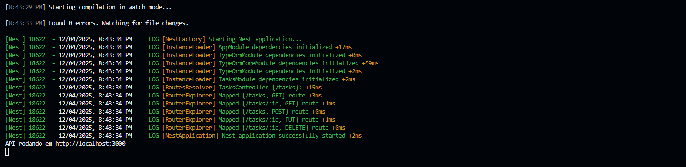
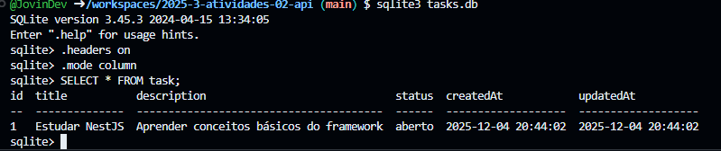

# API de Tarefas - NestJS
- **Professor**: [L A Minora](https://github.com/leonardo-minora/)
- **Aluno**: [João Vinicius](https://github.com/jovindev/)

Projeto de exemplo para gerenciamento de tarefas utilizando NestJS, TypeORM e SQLite.

## Como executar o projeto

```bash
cd tasks-api
npm install
npm run start:dev
```

O servidor estará disponível em http://localhost:3000

> O banco de dados é salvo no arquivo `tasks.db` na raiz da pasta `tasks-api`.

## Endpoints disponíveis

| Método | Rota             | Descrição                  |
|--------|------------------|----------------------------|
| POST   | /tasks           | Criar nova tarefa          |
| GET    | /tasks           | Listar todas as tarefas    |
| GET    | /tasks/:id       | Buscar tarefa por ID       |
| PUT    | /tasks/:id       | Atualizar tarefa           |
| DELETE | /tasks/:id       | Remover tarefa             |


## Demonstração dos Endpoints



## Exemplos de uso (curl)

### Criar tarefa
```bash
curl -X POST http://localhost:3000/tasks \
  -H "Content-Type: application/json" \
  -d '{
    "title": "Estudar NestJS",
    "description": "Aprender conceitos básicos do framework",
    "status": "aberto"
  }'
```

### Listar tarefas
```bash
curl http://localhost:3000/tasks
```

### Buscar tarefa específica
```bash
curl http://localhost:3000/tasks/1
```

### Atualizar tarefa
```bash
curl -X PUT http://localhost:3000/tasks/1 \
  -H "Content-Type: application/json" \
  -d '{
    "status": "fazendo"
  }'
```

### Deletar tarefa
```bash
curl -X DELETE http://localhost:3000/tasks/1
```


## Visualização do Banco de Dados



## Para acessar pelo terminal o Banco de Dados, rode os seguintes comandos:
```sqlite3 tasks.db
.headers on
.mode column
SELECT * FROM task;

## Observações

- O arquivo `tasks.db` contém dados de exemplo e é criado automaticamente.
Para acessar pelo terminal, rode os seguintes comandos:
sqlite3 tasks.db
.headers on
.mode column
SELECT * FROM task;
Para sair do SQLite, digite:
.exit

- Os campos obrigatórios são validados e erros são retornados em caso de dados inválidos.
- Tarefas possuem timestamps automáticos (`createdAt`, `updatedAt`).

---
Projeto baseado no tutorial: https://github.com/infoweb-pos/api-nest-notas-01-introducao